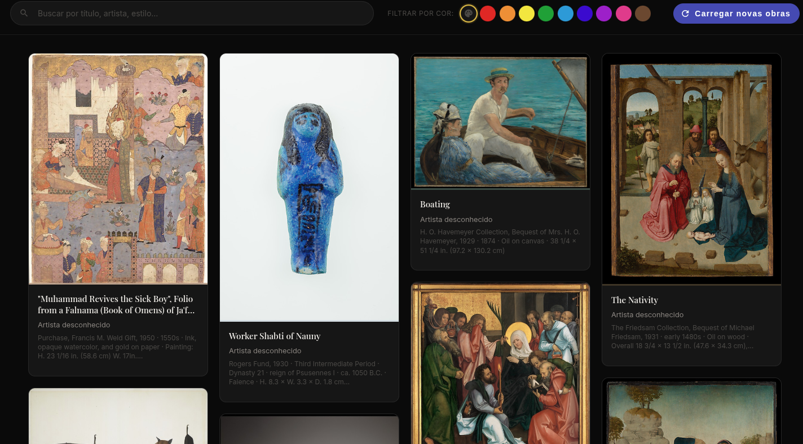
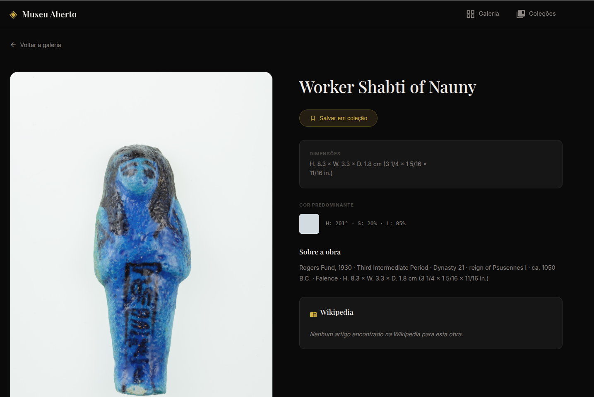

# Museu Aberto

Galeria digital de arte com frontend Angular e backend Spring Boot.
O backend usa a Met Museum public collection API e consulta a Wikipedia para complementar detalhes, aplica cache e expõe uma API para busca, detalhes e coleções por sessão.

## Screenshots

### Pagina principal



### Detalhe de obra



## Visao Geral

- Frontend: Angular 17 (standalone), Angular Material, SCSS
- Backend: Java 17, Spring Boot 3.2.3, Spring Data JPA, H2, Caffeine
- Porta padrao da aplicacao: 8091
- API base: /api

O projeto suporta dois modos de uso:

- Modo portatil: roda somente o backend (com frontend ja empacotado em static)
- Modo desenvolvimento: frontend Angular separado na porta 4200 com proxy para o backend

## Como usar este repositório

Para instruções de execução, build e desenvolvimento, veja [STARTERS.md](STARTERS.md).

## Estrutura do Repositorio

```text
museu-aberto/
├── backend/
│   ├── pom.xml
│   ├── data/                         # Arquivos do banco H2 em disco
│   └── src/
│       ├── main/java/com/museuaberto
│       │   ├── config/
│       │   ├── controller/
│       │   ├── model/
│       │   ├── repository/
│       │   └── service/
│       └── main/resources/
│           ├── application.properties
│           └── static/               # Build do frontend copiado para o backend
├── frontend/
│   ├── angular.json
│   ├── package.json
│   ├── proxy.conf.json
│   └── src/
├── run-from-zero.sh                  # Rebuild completo frontend + backend
├── start.sh                          # Execucao portatil (Linux/macOS)
└── start.bat                         # Execucao portatil (Windows)
```

## Requisitos

### Para modo portatil

- Java 17 ou superior

### Para modo desenvolvimento completo

- Java 17 ou superior
- Maven 3.9+
- Node.js 18+ (recomendado 20+)
- npm 9+

## Como usar este repositório

Para instruções de execução, build e desenvolvimento, veja [STARTERS.md](STARTERS.md).

## Configuracoes Relevantes

## Configuracoes Relevantes

Arquivo: backend/src/main/resources/application.properties

- server.port=8091
- spring.datasource.url=jdbc:h2:file:./data/museuaberto;DB_CLOSE_ON_EXIT=FALSE
- spring.h2.console.enabled=true
- spring.h2.console.path=/h2-console
- spring.web.cors.allowed-origins=http://localhost:4200
- spring.cache.type=caffeine

## API Principal

Base URL: http://localhost:8091/api

### Saude

- GET /health

### Obras

- GET /artworks?page=1&limit=20
- GET /artworks/search?q=monet&page=1&limit=20
- GET /artworks/{id}
- GET /artworks/{id}/wikipedia
- GET /artworks/department/{department}?page=1&limit=20

### Colecoes (por sessao)

- GET /collections
- GET /collections/{id}
- POST /collections
- PUT /collections/{id}
- DELETE /collections/{id}
- POST /collections/{id}/artworks/{artworkId}
- DELETE /collections/{id}/artworks/{artworkId}
- GET /collections/{id}/artworks
- GET /collections/artwork/{artworkId}
- GET /collections/session

## Sessao e Colecoes

- O frontend envia o header X-Session-Id em todas as chamadas via interceptor.
- Se o header nao existir, o backend usa sessao HTTP padrao.
- No frontend, o sessionId e persistido em localStorage.

## Testes

- Backend: no momento nao ha testes automatizados em backend/src/test/java.
- Frontend: configurado para Karma/Jasmine via npm test.

## Solucao de Problemas

- Erro de CORS em desenvolvimento:
	confirme backend em 8091 e frontend em 4200.
- Erro 404 em rotas do Angular no modo portatil:
	confirme que o build do frontend foi copiado para backend/src/main/resources/static.
- Script start.sh falha dizendo que nao encontrou JAR:
	gere o pacote com mvn clean package em backend.
- Dados antigos no banco:
	remova backend/data/museuaberto.mv.db e reinicie, ou rode run-from-zero.sh.
